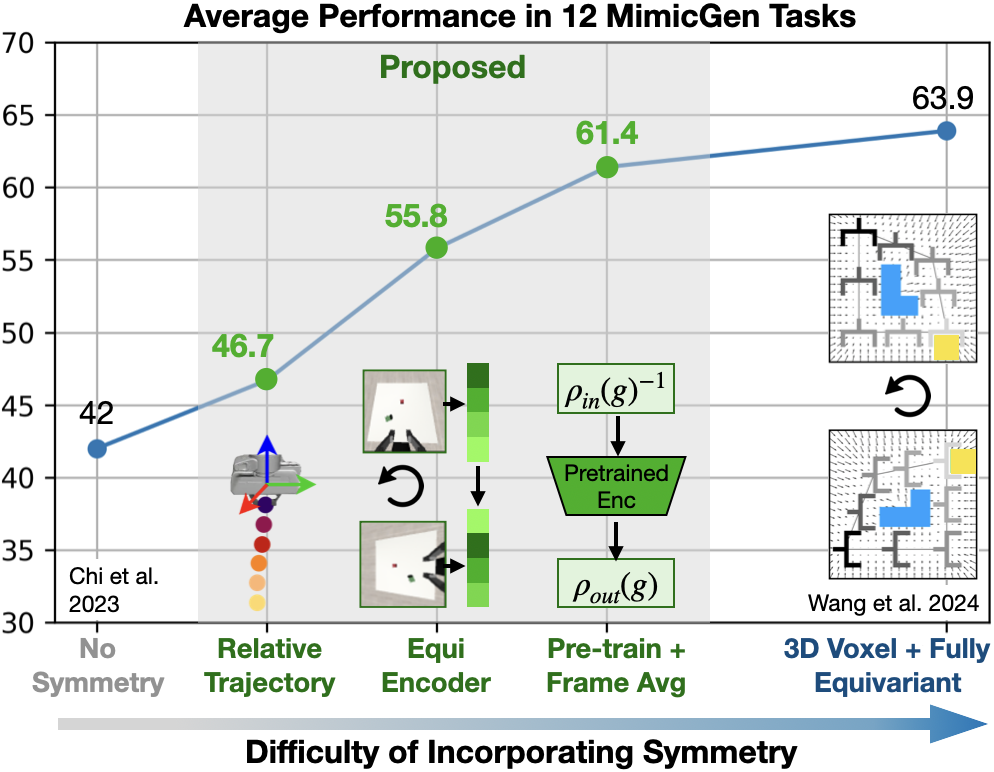

# A Practical Guide for Incorporating Symmetry in Diffusion Policy
[Project Website](https://sym-in-dp.github.io) | [Paper](https://arxiv.org/pdf/2505.13431)  
<a href="https://dianwang.io/">Dian Wang</a><sup>1</sup>, <a href="https://bocehu.github.io">Boce Hu</a><sup>2</sup>, <a href="https://shurans.github.io">Shuran Song</a><sup>1</sup>, <a href="https://www.robinwalters.com/">Robin Walters</a><sup>2</sup>, <a href="https://helpinghandslab.netlify.app/people/">Robert Platt</a><sup>2</sup>  
<sup>1</sup>Stanford Univeristy, <sup>2</sup>Northeastern Univeristy  
NeurIPS 2025



## Installation
1.  Install the following apt packages for mujoco:
    ```bash
    sudo apt install -y libosmesa6-dev libgl1-mesa-glx libglfw3 patchelf
    ```
1. Install gfortran (dependancy for escnn) 
    ```bash
    sudo apt install -y gfortran
    ```

1. Install [Mambaforge](https://github.com/conda-forge/miniforge#mambaforge) (recommended) or Anaconda
1. Install environment:
    ```bash
    mamba env create -f conda_environment.yaml
    conda activate symindp
    ```
    or: 
    ```bash
    conda env create -f conda_environment.yaml
    conda activate symindp
    ```
1. Force reinstall lie-learn (due to a known [issue](https://github.com/AMLab-Amsterdam/lie_learn/issues/16#issuecomment-824856075))
    ```bash
    pip uninstall lie-learn
    pip install git+https://github.com/AMLab-Amsterdam/lie_learn@07469085ac0fd4550fd26ff61cb10bb1e92cead1
    ```
1. Install robosuite:  
    Notice that this fork of robosuite has the large FOV in-hand camera. To use the standard FOV camera, do `git clone https://github.com/ARISE-Initiative/robosuite.git -b b9d8d3de5e3dfd1724f4a0e6555246c460407daa` instead.  
    ```bash
    cd ..
    git clone https://github.com/BoceHu/robosuite.git
    cd robosuite
    pip install -e .
    cd ..
    ```
1. Install robomimic:
    ```bash
    git clone https://github.com/pointW/robomimic.git
    cd robomimic
    pip install -e .
    cd ..
    ```
1. Install robosuite-task-zoo:
    ```bash
    git clone https://github.com/pointW/robosuite-task-zoo.git
    cd robosuite-task-zoo
    pip install -e .
    cd ..
    ```
1. Install mimicgen:
    ```bash
    git clone https://github.com/NVlabs/mimicgen_environments.git
    cd mimicgen_environments
    git checkout 45db4b35a5a79e82ca8a70ce1321f855498ca82c
    pip install -e .
    cd ../sym_in_dp
    ```
1. Make sure mujoco version is 2.3.2 (required by mimicgen)
    ```bash
    pip list | grep mujoco
    ```

## Dataset
### Download Dataset
Download dataset from MimicGen's hugging face: https://huggingface.co/datasets/amandlek/mimicgen_datasets/tree/main/core  
Make sure the dataset is kept under `/path/to/sym_in_dp/data/robomimic/datasets/[dataset]/[dataset].hdf5`
### Generating Large FOV Observation

```bash
# Template
python sym_in_dp/scripts/dataset_states_to_obs.py --input data/robomimic/datasets/[dataset]/[dataset].hdf5 --output data/robomimic/datasets/[dataset]/[dataset]_fisheye.hdf5 --num_workers=[n_worker]
# Replace [dataset] and [n_worker] with your choices.
# E.g., for stack_d1
python sym_in_dp/scripts/dataset_states_to_obs.py --input data/robomimic/datasets/stack_d1/stack_d1.hdf5 --output data/robomimic/datasets/stack_d1/stack_d1_fisheye.hdf5 --num_workers=24
```

### Convert Action Space in Dataset
The downloaded dataset has a relative action space. To train with absolute action space, the dataset needs to be converted accordingly
```bash
# Template
python sym_in_dp/scripts/robomimic_dataset_conversion.py -i data/robomimic/datasets/[dataset]/[dataset].hdf5 -o data/robomimic/datasets/[dataset]/[dataset]_abs.hdf5 -n [n_worker]
# Replace [dataset] and [n_worker] with your choices.
# E.g., convert stack_d1_fisheye with 12 workers
python sym_in_dp/scripts/robomimic_dataset_conversion.py -i data/robomimic/datasets/stack_d1/stack_d1_fisheye.hdf5 -o data/robomimic/datasets/stack_d1/stack_d1_fisheye_abs.hdf5 -n 12
```

## Training Rel Traj CNN Enc
```bash
python train.py --config-name=train_diffusion_unet_rel_traj task_name=stack_d1
```
To train in other tasks, replace `stack_d1` with `stack_three_d1`, `square_d2`, `threading_d2`, `coffee_d2`, `three_piece_assembly_d2`, `hammer_cleanup_d1`, `mug_cleanup_d1`, `kitchen_d1`, `nut_assembly_d0`, `pick_place_d0`, `coffee_preparation_d1`. Notice that the corresponding dataset should be downloaded already. 

## Training Rel Traj Equi Enc
```bash
python train.py --config-name=train_diffusion_unet_equi_enc_rel_traj task_name=stack_d1
```

## Training Rel Traj Pretrain
```bash
python train.py --config-name=train_diffusion_unet_pretrained_res18_rel_traj task_name=stack_d1
```

## Training Rel Traj Pretrain + FA
```bash
python train.py --config-name=train_diffusion_unet_pretrained_res18_fa_rel_traj task_name=stack_d1
```

